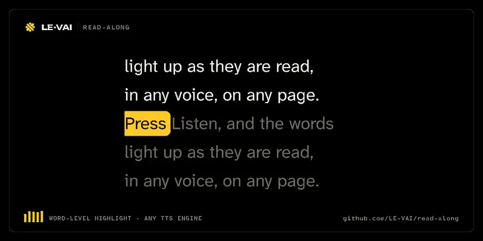

# read-along

<!-- vai-hero:start -->
<p align="center">
  <picture>
    <source media="(prefers-reduced-motion: reduce)" srcset="docs/media/hero-poster.png">
    
  </picture>
</p>
<p align="center"><sub>A 4.8-second loop. It plays once and rests, and shows a still frame if you prefer reduced motion. <a href="https://le-vai.github.io/LE-VAI/loops/#read-along">Watch it on repeat</a>.</sub></p>
<!-- vai-hero:end -->

An embeddable, engine-agnostic web component for **bimodal reading**:
karaoke-style word highlighting synchronized to spoken audio, for the open web.

Wrap it around any content. Press Listen. The words light up as they're read.

```html
<script type="module" src="read-along.js"></script>

<read-along>
  <p>Any content. Any <em>inline markup</em>. Your links stay clickable,
  your styles stay yours — the highlight paints over the text without
  touching the DOM.</p>
</read-along>
```

## Why

- **Evidence-backed.** Bimodal (listen-while-read) presentation measurably
  improves comprehension for readers with dyslexia and other reading
  disabilities — strongest when highlighting follows the voice word-by-word
  (Wood et al. 2017 meta-analysis). Word-level and sentence-level
  highlighting are both provided: karaoke word tracking over a soft sentence
  tint, since research treats granularity as a user preference
  (w3c/epub-specs#2917). Yet no embeddable, open-source read-along component
  exists for the web. This is that missing primitive.
- **For everyone.** Dyslexic readers, language learners, low-vision readers,
  tired commuters, cooks with flour on their hands.
- **Local-first.** Speech runs in the browser. Nothing is sent anywhere by
  default.

## How this relates to prior art (honest table)

| | read-along | `@liiift-studio/speechtype` | MS Immersive Reader | ReadSpeaker / NaturalReader |
|---|---|---|---|---|
| Open source | ✅ MIT | ✅ MIT | ❌ Azure commercial | ❌ subscription |
| Embeddable web component | ✅ | ⚠️ React/vanilla functions | ⚠️ Azure SDK | ⚠️ embed script |
| Engine-agnostic | ✅ pluggable | ❌ Web Speech only | ❌ | ❌ |
| Sync when `boundary` events don't fire | ✅ interpolation fallback | ❌ ("text simply stays un-emphasised") | — | — |
| Markup-safe highlighting | ✅ Range-based (Highlight API) | ❌ span-wrapping, flattens markup | — | — |

`speechtype` is the closest open prior art and a genuinely nice piece — its
README honestly documents the Safari boundary-event gap that read-along's
interpolation fallback exists to close. The abandoned `readalong` npm
package (2018) played pre-aligned audio files; not TTS, not embeddable.
Everything else in the space is commercial.

## Features

- **Zero dependencies**, MIT license. The core import chain
  (`read-along.js` + `tokenizer.js` + `highlight.js` + `styles.js` +
  `pronunciations.js` + `natural-voice.js` + `engines/webspeech.js`) measures
  **~26.5 kB gzipped** (84 kB raw) as shipped. That is unminified source, and
  about half of it is comments: with comments stripped it is ~13.4 kB
  gzipped, and a minifier does better still. Measure for yourself with a
  bundler analyser rather than trusting a number in a README — including this
  one, which once said "~5 kB" and was simply wrong.
- **Markup-safe highlighting** via the CSS Custom Highlight API (`Highlight`
  + `::highlight()`), with a graceful `<mark>` fallback. Your content's DOM
  is never re-wrapped on the modern path.
- **Chrome's 15-second speech bug defeated.** Desktop Chrome's speech engine
  watchdog kills long utterances (a bug open for years, ~200–250 chars).
  read-along speaks in sentence-bounded chunks that stay under the cap,
  plus a desktop-only keep-alive (skipped on Android, where it breaks
  synthesis).
- **Robust word sync.** Locks onto `onboundary` events when the engine
  provides them; falls back to char-proportional interpolation when it
  doesn't (remote voices, Firefox).
- **Never a silent dead end.** Browsers that expose `speechSynthesis` with
  zero voices (common in embedded/webview browsers) get detected by a stall
  watchdog and the component switches to visual-only mode — karaoke word
  pacing without sound, announced to screen readers, instead of hanging on
  "Playing" forever.
- **One-voice policy.** Starting one `<read-along>` stops any other
  currently playing on the page.
- **Word-level seek.** `seekToToken(i)` (or the `seekable` attribute — click
  any word mid-read) restarts playback at an exact word, in every engine.
- **External clock.** An engine that renders-only: a host process outside
  the browser supplies word timings and ticks the clock — the bridge
  contract for desktop readers and assistive controllers.
- **Theming.** `--ra-highlight` / `--ra-accent` CSS custom properties set
  the highlight color per page or per instance (plain `rgb()` values —
  exotic color functions risk silent drops in hostile engines).
- **Pluggable engines.** Ships with Web Speech (default), a
  pre-synthesized-media engine (build-time TTS + JSON timing manifest —
  Piper/kokoro/cloud batch outputs all fit), a local neural voice (Kokoro),
  and the external-clock engine. Bring any engine implementing
  `speak/pause/resume/stop/setChunks` + `onToken` callbacks.
- **Pronunciation fixes that never touch the page.** A `pronunciations` map
  changes what the voice *says* (`Theravada` → `Terra-vah-dah`) for every
  engine, while the visible text, the highlight and every word index stay on
  the words as written. [Details](#pronunciations).
- **Opt-in natural voice.** Web Speech stays the default; a host can offer a
  local neural voice (Kokoro) behind a "Natural voice" button that discloses
  the one-time ~80–90 MB download, swaps in at the current word, and is
  remembered. [Details](#natural-voice-opt-in).
- **Pronunciation you can verify.** `read-along-verify` synthesizes a script,
  transcribes it back, and control-tests every mismatch with a second voice,
  so a "defect" is confirmed before anyone changes anything.
  [Details](#verifying-pronunciation-read-along-verify).
- **Accessible controls.** Real buttons, `aria-pressed`, visible focus,
  polite live announcements, keyboard operable end to end, and no reduced-
  opacity or translucent text: zero axe 4.13 violations on light and dark
  host pages.

## Install

```bash
npm install @designesy/read-along
```

or vendor the files — it's dependency-free ES modules.

Two optional peer dependencies, `kokoro-js` and `@huggingface/transformers`,
are needed only for the Kokoro engine and the `read-along-verify` CLI. The
component never imports them, and npm does not install them for you.

## Attributes

| Attribute | Default | Purpose |
|---|---|---|
| `lang` | page language | BCP-47 tag passed to the speech engine |
| `rate` | `1` | initial speaking rate |
| `seekable` | off | clicking/tapping a word while playing restarts the reading from that word (never steals clicks on links/buttons) |
| `force-fallback` | off | skip the CSS Custom Highlight API and wrap the active word in a `<mark>` element instead — for engines that expose the highlight registry but never paint it (undetectable programmatically), or when you want maximum-render-compatibility certainty |
| `pronunciations` | none | JSON object of spoken forms, e.g. `{"Theravada": "Terra-vah-dah"}` — see [Pronunciations](#pronunciations). Invalid JSON is ignored with a console warning; playback is unaffected |

The word highlight is page-global: all `<read-along>` elements share one
`Highlight` registry entry per name, so multiple instances on a page
coexist correctly (each contributes and removes only the Ranges it owns).

## Controls

- `play()` / `pause()` / `stop()` / `toggle()`
- `seekToToken(i)` — start playing from word *i* (0-based)
- `activeToken` — index of the word currently spoken (-1 when idle)
- `engine` property — swap in your own engine before first play
- `pronunciations` property — an object (or Map, or JSON string) of spoken
  forms; reads back the entries in force, or `null`
- `naturalVoice` property — a loader function that returns an engine; shows
  the "Natural voice" button (see [Natural voice](#natural-voice-opt-in))
- `state` — `"idle" | "playing" | "paused"`
- events: `play` / `pause` / `stop` / `done` / `seek` (bubbles). `detail.token`
  is **always a word index, whichever engine is in use** — the component
  normalises it, because the engines do not agree on what `position` returns
  (`ExternalEngine` gives a bare number, the others give `{ chunk, token }`).
  `detail.position` carries the engine's own value unchanged if you want it.
  Hosts driving an external clock use these to anchor their own timers.

## Pronunciations

A neural voice can be fluently, confidently wrong. Kokoro reads **Theravada**
as **"The Ravada"**, dropping the first syllable, and nothing in the pipeline
says so. In an assistive tool that is a correctness failure: it teaches the
wrong word with full confidence.

**Never edit the source text to satisfy a TTS engine.** Respelling the page
corrupts it for every sighted reader, every screen reader and every other
engine. Change what the *engine* is given instead:

```html
<read-along pronunciations='{"Theravada": "Terra-vah-dah", "SUM": "S U M"}'>
  <p>Theravada is the oldest surviving school of Buddhism.</p>
</read-along>
```

```js
el.pronunciations = { Theravada: "Terra-vah-dah", "Abu Bakr": "Ah-boo Bahk-er" };
```

What the reader sees, what is highlighted, and every public word index
(`activeToken`, `seekToToken`, event `detail.token`, `position`) stay on the
**visible** words. Only the speech changes.

Matching rules:

- **Whole word, case-insensitive.** "Whole" means not touching a letter,
  digit or combining mark: `Theravada,` `(Theravada` and `Theravada's` match,
  `Theravadin` does not.
- **Multi-word keys** are allowed (`"Abu Bakr"`), and match across a line
  break in the source.
- **Leftmost match first; at one position the longest key wins.** One pass:
  a replacement is never matched again.
- Entries whose key or value is not a non-empty string are skipped with a
  console warning. An empty replacement is refused on purpose: a word the
  voice never says would leave the highlight skipping a word for no reason
  the reader can see.

How it reaches each engine:

- **Web Speech** speaks the spoken text. `onboundary` reports offsets into
  that string, so the engine maps each one back to the visible word: every
  boundary inside `Terra-vah-dah` (including the separate ones some voices
  fire at hyphens) lands on `Theravada`. A replacement with spaces
  (`S U M`) still maps to exactly one word; a multi-word replacement is dealt
  out across its key's words in order.
- **Kokoro** synthesizes the spoken text, and its word timings divide the
  real audio duration over the spoken characters, so `Theravada` is timed as
  the longer word the voice actually says. Changing a pronunciation
  re-synthesizes the chunk instead of replaying cached audio.
- **Pre-synthesized media** cannot be changed after the fact, so the map
  applies where the audio is made, with the same module. In the build step,
  chunk the text with `tokenizer.js` and call
  `applySpokenViews(chunks, compilePronunciations(map))` from
  `@designesy/read-along/pronunciations.js`. Then synthesize
  `spokenText(chunk)` for each chunk and pass the chunk to
  `wordTimingsFromChunk()`. The manifest comes out in visible token indexes.
- **External clock** — the chunks handed to `ExternalEngine` carry the same
  spoken views (`engine.chunks`), so a host bridge can send its own TTS
  `spokenText(engine.chunks[i])`, the same text the built-in engines say.

A custom engine that ignores `chunk.spoken` simply keeps speaking the visible
words. To honour it, say `spokenText(chunk)` and map offsets back with
`spokenTokenAt(chunk, charIndex)`, both exported from `pronunciations.js`.

Find the words that need a pronunciation with `read-along-verify`, below,
rather than by ear alone, and confirm each one there before adding it.

## Natural voice (opt-in)

Web Speech is the default: free, instant, already on the device. A neural
voice sounds far better but costs a one-time download, so it is never fetched
unasked. The host opts in by giving the component a **loader**; the reader
opts in by pressing the button.

```js
el.naturalVoice = async () => {
  const { KokoroEngine } = await import("@designesy/read-along/engines/kokoro.js");
  return new KokoroEngine({ voice: "af_heart" });
};
```

Setting `naturalVoice` renders an extra control: a real `<button>` named
"Natural voice", with `aria-pressed`, visible focus, and a visible note
(also its accessible description) that says it **downloads a voice model of
about 80–90 MB, once**. Pressing it:

1. loads the engine. The standard voice keeps reading meanwhile, and the
   download is narrated through the polite live region at 25/50/75%, never
   per tick, so it does not talk over the reading;
2. swaps the engine in **at the current word**: if reading, it continues
   from that word in the new voice; if paused, the next Listen resumes there;
3. remembers the choice in `localStorage` (every access wrapped; where
   storage throws, the choice lasts for the page). On a later visit a
   remembered choice upgrades by itself, quietly unless the swap moved the
   reading position or failed.

Pressing it again switches back to the standard voice at the current word,
or cancels a download in progress (the download cannot be aborted, but the
swap is). If loading fails, the standard voice keeps reading, the failure is
announced, and the choice is **not** remembered, so the next visit does not
re-download into the same failure.

The core never imports `kokoro-js`: your loader does, so bundlers only see it
if you write that import. A loader for some other engine can give its own
download size for the disclosure:
`el.naturalVoice = { load: myLoader, downloadSize: "about 60 MB" }`. Each
player loads its own copy of the engine; the browser caches the download, so
later players load from cache.

## Verifying pronunciation (`read-along-verify`)

A pronunciation defect is invisible from the text and easy to miss by ear.
`read-along-verify` checks a script from the outside:

```bash
npm install --save-dev kokoro-js @huggingface/transformers@^3
npx read-along-verify notes.md
npx read-along-verify notes.md --pronunciations fixes.json
```

The protocol, one sentence at a time:

1. **Synthesize** with Kokoro, the same voice as "Natural voice".
2. **Transcribe it back** with Whisper (`onnx-community/whisper-small`) and
   diff it against the written words. Sentence context, not isolated words:
   a word list transcribes back scrambled.
3. **Control-test every mismatch** by saying the same sentence with the
   operating system's own voice (Windows SAPI, macOS `say`, espeak-ng on
   Linux) and transcribing that too.
4. **Fix at the engine boundary**, with a `pronunciations` entry. Never in
   the content.

Step 3 is the point. A transcriber has spelling habits of its own: in the
session that motivated this tool, `mihrab` came back as "mirab" and `Sawm` as
"Psalm" — and the second voice came back the same way. Both pronunciations
were correct. "Fixing" them would have made the audio worse and corrupted
the document. **A reported defect is a hypothesis until a second engine
confirms it.** Each finding is classified:

| Classification | Meaning |
|---|---|
| `synthesis-defect` | the control voice was heard as written, Kokoro was not: the fault is in the speech. Add a pronunciation. |
| `transcription-artifact` | both voices were heard the same wrong way: the transcriber respells the word. Leave it. |
| `inconclusive` | the control was wrong too, differently. Listen yourself. |
| `unconfirmed` | no OS voice was found, so nothing was control-tested (a warning says so). |

With `--pronunciations <file.json>` the same map the component uses (one
implementation) is applied to the spoken text, and each replaced word is
reported as `fixed` when it now comes back as the word on the page,
`not-fixed` when it still does not, or `unverifiable` when even the control
voice is transcribed differently. Keys that never occur are listed as unused.

A real run, `af_heart`, with Windows SAPI as the control:

```text
Findings
  1. synthesis-defect, sentence 1
     written:  Theravada
     heard:    The Ravada
     control:  Theravada
  2. transcription-artifact, sentence 2
     written:  mihrab
     heard:    Mirab
     control:  mirab
  3. transcription-artifact, sentence 2
     written:  Sawm
     heard:    Psalm
     control:  Psalm
```

and with `{"Theravada": "Terra-vah-dah"}`:

```text
Pronunciation fixes
  fixed: Theravada, spoken as "Terra-vah-dah", heard "Theravada" (sentence 1)
```

Options: `--voice <id>` (Kokoro voice, default `af_heart`), `--model <id>`
(Whisper model), `--dtype q8|fp32` (Whisper weights: q8 ~250 MB by default,
fp32 ~1 GB and most accurate), `--json` (machine-readable report on stdout;
progress goes to stderr). Markdown (`.md`) is reduced to its readable text
first. The input file is only ever read.

Exit codes: `0` no confirmed problems, `1` a `synthesis-defect` or a
`not-fixed` fix, `2` could not run (usage, unreadable input, missing
dependency — with the exact install command). `inconclusive` and
`unconfirmed` do not fail the run, by the rule above. The first run downloads
the models from Hugging Face (Kokoro ~90 MB, Whisper small ~250 MB at q8);
everything runs locally after that.

## Custom engines

Anything with this shape works — WASM neural TTS, pre-synthesized audio, a
remote service, or a lab prototype:

```js
class MyEngine {
  setChunks(chunks) {}
  speak(chunks, startWord = 0) { /* call onToken(i) as words start */ }
  pause() {}
  resume() {}
  stop() {}
}
readAlongEl.engine = new MyEngine();
```

`startWord` is a global token index — seek lands on the exact word, not the
containing chunk. A chunk may carry `spoken` when pronunciations apply — see
[Pronunciations](#pronunciations).

The engine contract and token/chunk formats live in `src/tokenizer.js` and
`src/engines/*.js`.

## External clock (host-driven highlighting)

`src/engines/external.js` — render-only mode: the host owns the audio and the
clock, the component just highlights. This is the bridge contract for
non-browser speech systems:

- a **desktop reader daemon** (e.g. a Piper TTS process) streaming word
  timings while it plays audio itself
- an **assistive/BCI controller** that knows the reading position and needs
  a text surface to mirror it
- **build-time timings with no audio at all** — silent visual karaoke

```js
import { ExternalEngine } from "@designesy/read-along/engines/external.js";
const engine = new ExternalEngine({ words: [] }); // [tokenIndex, startMs, endMs]
el.engine = engine;
el.play();
engine.setWords([[0, 0, 260], [1, 260, 520], /* … */]); // whenever ready
engine.tick(1234); // host heartbeat: elapsed playback ms
```

Semantics: `tick()` advances the word pointer (monotonic; jumps larger than
a word are followed, so a host restarting earlier works too). If the host
goes silent for >250 ms the engine falls back to real time — a dead bridge
never freezes the karaoke. `setWords()` can arrive late and grow during
playback (progressive synthesis). `speak(chunks, startWord)` starts at any
word. Pause freezes everything until `resume()`.

Timings format matches the MediaEngine manifest (`[tokenIndex, startMs,
endMs]`) — one producer can feed both engines.

## Local neural voice (Kokoro)

`src/engines/kokoro.js` is an optional engine that runs the
[Kokoro-82M](https://huggingface.co/onnx-community/Kokoro-82M-v1.0-ONNX)
neural voice (via [kokoro-js](https://www.npmjs.com/package/kokoro-js))
entirely in the browser — real voices on any tab, including embedded
browsers whose Web Speech has none.

```js
import { KokoroEngine } from "@designesy/read-along/engines/kokoro.js"; // (or vendor the file)
const engine = new KokoroEngine({ voice: "af_heart" }); // af_bella, am_michael, …
await engine.load();          // optional: preload the ~80 MB model (q8)
el.engine = engine;           // else it loads on first play
```

To let the reader choose it instead, hand the same construction to
`naturalVoice` (above). `load()` reports download progress through
`onProgress(pct, label)`, and the speed control drives Kokoro's synthesis
speed (`rate` maps to `speed`, from the next chunk synthesized).

Honest notes:

- **Timing.** The public ONNX export does not expose the model's native
  word alignment (Python `KPipeline` has it; the ONNX graph itself does
  not). The engine distributes each chunk's *measured* audio duration
  across its characters — real durations, sentence-bounded error — and
  drives the highlight from the `AudioContext` sample clock, not wall-clock
  guessing. Pause is sample-accurate (`AudioContext.suspend()` freezes the
  clock; resume continues from the exact sample).
- **Cost.** First load downloads ~80 MB (q8) and compiles WASM — expect
  ~30–60 s on a cold cache, seconds warm. Synthesis is cached per chunk
  (restart/seek is instant) and pipelined one chunk ahead.
- **Demo wiring.** kokoro-js's ESM dist statically imports the Node
  built-ins `path` and `fs/promises`, which browsers can't resolve — an
  import map must stub both (see `demo/index.html`). And in the browser,
  transformers.js accepts only `wasm`/`webgpu` devices — `"cpu"` is a
  Node-only device name (the engine translates it).
- This engine pulls in `kokoro-js` as a dependency, so it lives outside
  the zero-dependency core; the component itself never imports it.

## Engine notes (Web Speech, 2026)

- Desktop Chrome truncates long utterances (~15 s watchdog, ~200–250 chars;
  [chromium:41294170](https://issues.chromium.org/issues/41294170)) — handled
  by sentence-bounded chunking (every utterance under the cap), plus a
  desktop-only pause/resume keep-alive (the keep-alive is skipped on Android,
  where it breaks synthesis).
- `onboundary` is an optimization, not a sync source: it doesn't fire for
  remote voices (Chromium 41195426), fails on Chrome Android, fires sparsely
  on Safari, and iOS effectively never — read-along falls back to
  char-proportional interpolation whenever boundaries stay silent.
- Voices load async (`voiceschanged`); first `getVoices()` may be empty —
  handled. Pick a voice explicitly via `engine.voiceName` if it matters.
- iOS requires `speak()` inside a user gesture — playing from the Listen
  button satisfies this; don't call `play()` from timers on iOS.
- The Web Speech spec is actively maintained under the Web Audio CG (draft
  dated 2026-08-10); read-along tracks it conservatively.

## Browser support

- **Highlighting:** CSS Custom Highlight API is Baseline 2025 (Chrome/Edge
  105+, Safari 17.2+, Firefox 140+). Older engines get the `<mark>` fallback.
- **Speech:** Web Speech synthesis is available in all desktop evergreen
  browsers; Firefox for Android lacks it entirely — that's what the pluggable
  engine slot is for (kokoro-js / Piper WASM / pre-synthesized media all fit
  the same contract).

## Accessibility

- Real `<button>`s (≥ 30×30 px targets — WCAG 2.5.8 needs 24×24), visible
  focus (2.4.7), full keyboard operability (2.1.1).
- Polite `aria-live` region for state changes (4.1.3): announces
  play/pause/finish — deliberately NOT per-word (per-word announcements
  flood screen readers; sentence-boundary announcing is the considerate
  pattern).
- The Highlight API paints carry no semantic meaning (MDN) — visual karaoke
  is decoration; the semantic channel is the live region + natural DOM order
  (1.3.2), which the Range-based approach never disturbs.
- Contrast (1.4.3, 1.4.11). Controls paint their own background and use the
  system pair `Canvas`/`CanvasText`; loose text (the status, the natural-voice
  note) inherits the **host's** text colour at full strength, because it sits
  on the host's background. Before 0.3.0 the status forced `CanvasText` at
  75% opacity, which on a dark host page without `color-scheme` was
  near-black on near-black: axe 4.13 measured 1.15:1, a serious failure.
  Pressed state is a heavier outline plus a label or icon change, never a
  colour alone.
- The "Natural voice" toggle keeps focus through loading (no `disabled`),
  its state is `aria-pressed`, and its download disclosure is both visible
  and its accessible description.

## Status

**Published** on npm as `@designesy/read-along`, MIT, 125 tests, CI on Node
18/20/22. Core engine, highlight layer, four engines (Web Speech, media,
Kokoro, external clock), word-level seek + click-to-seek, CSS-var theming,
pronunciations, the opt-in natural voice, the `read-along-verify` CLI, live
demos. Changes per release are in `CHANGELOG.md`.

**Screen-reader verified.** The live region is confirmed announced under a real
screen reader, including the repeated-identical-message case: NVDA 2026.2 with
Chromium 153 on Windows 11, 2026-09-22, all six checks passed. See
`docs/AT-TEST-RESULT.md` for the environment and the exact method. That file
also records what the result does *not* imply — JAWS, Narrator, and VoiceOver
are untested, and the shadow root is the part most likely to differ between
implementations.

### Integrating it into a server-rendered app — read this first

**The module cannot be imported in any server context.** It builds its template
and calls `customElements.define()` at module top level, so a static import in
a Node/prerender environment throws `ReferenceError: document is not defined`.
Verified. This means:

- **Client Components are still prerendered on the server**, so a *static*
  import inside a `'use client'` file fails at build time too.
- Register it with a **dynamic `import()` inside `useEffect`**, or
  `next/dynamic` with `ssr: false` — and `ssr: false` only works inside a
  Client Component.
- Render the **tag and its children** server-side; never the module. The
  children are plain HTML and read fine before upgrade, so progressive
  enhancement works by construction.

**The highlight styles.** As of 0.2.0 the component self-injects the
`::highlight()` rules on connect — a constructable stylesheet where available,
a `<style>` element otherwise — and the injection is idempotent when the host
links them too. Set `no-inject-styles` on the element to opt out.

**Before 0.2.0 that was a silent failure, and it is worth knowing why the
injection exists.** The stylesheet was opt-in and separate: a host that imported
the module without also linking the CSS got a component that worked, painted
nothing, and reported no error — because the component injected no styles and
therefore could not notice their absence. That is fixed. The **explicit import
is still the supported way to theme it**, because that is the file which reads
your `--ra-highlight` / `--ra-accent` custom properties:

```js
import "@designesy/read-along/read-along.css";
```

**Do not write `@designesy/read-along/src/read-along.css`.** This package uses an
`exports` map, which gates every subpath: a path not listed there is unimportable
even though the file ships in the tarball. Until 0.1.4 the map listed only the JS
entry points, so the CSS was published but **unreachable** — `require.resolve`
returned `ERR_PACKAGE_PATH_NOT_EXPORTED`, and an integration written against the
path failed at resolver time while looking correct. On 0.1.3 or earlier, upgrade
or copy the file into your own tree.

`scripts/audit-exports.py` guards that class of defect: it compares the `files`
list against the `exports` map and reports anything shipped but unimportable.

**Add `read-along { display: block }` in your own CSS.** The element is
inline-level before upgrade and `display: block` after, so without this the
player's appearance shifts layout.

## License

MIT © 2026 LE-VAI